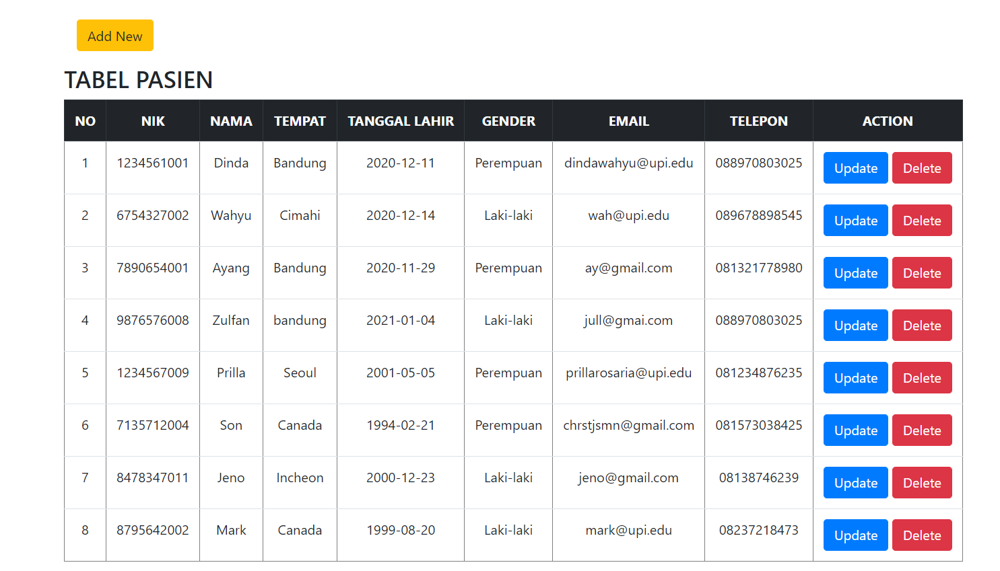
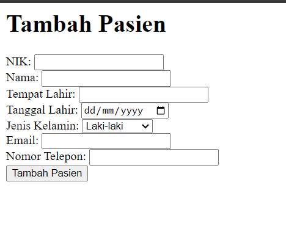

# Janji 
Saya Septiani Eka Putri NIM 2206000 mengerjakan Latihan Praktikum 11 dalam mata kuliah Desain dan Pemrograman Berorientasi Objek untuk keberkahanNya maka saya tidak melakukan kecurangan seperti yang telah dispesifikasikan. Aamiin

# Aplikasi Manajemen Pasien

Aplikasi Manajemen Pasien adalah sebuah sistem sederhana yang memungkinkan pengguna untuk menambahkan, mengupdate, dan menghapus data pasien. Aplikasi ini menggunakan bahasa pemrograman PHP dan MySQL untuk menyimpan dan mengelola data.

## Fitur Utama

1. **Tambah Pasien**: Pengguna dapat menambahkan data pasien baru melalui formulir input yang disediakan.
2. **Update Pasien**: Pengguna dapat memperbarui data pasien yang sudah ada melalui formulir update yang sesuai dengan ID pasien yang dipilih.
3. **Hapus Pasien**: Pengguna dapat menghapus data pasien berdasarkan ID pasien yang dipilih.
4. **Tampilan Indeks**: Aplikasi akan menampilkan daftar semua pasien dalam tabel di halaman indeks.

## Struktur Direktori

- **index.php**: Halaman utama aplikasi yang menampilkan daftar pasien dan menyediakan link untuk menambahkan, mengupdate, dan menghapus data pasien.
- **createView.php**: Kelas untuk menampilkan formulir tambah dan update pasien.
- **ProsesPasien.php**: Kelas untuk memproses logika bisnis penambahan, pembaruan, dan penghapusan data pasien.
- **model/TabelPasien.class.php**: Kelas untuk mengelola operasi database yang terkait dengan tabel pasien.
- **kontrakView.php**: Interface untuk view.
- **presenter/TampilPasien.php**: Kelas untuk menampilkan data pasien dalam bentuk tabel.

## Setup

1. Pastikan Anda memiliki server web lokal seperti XAMPP atau WAMP yang sudah diinstal.
2. Buat database MySQL dengan nama "mvp_php".
3. Impor file SQL `mvp_php.sql` ke dalam database yang baru dibuat.
4. Pastikan file konfigurasi `DB.class.php` telah diatur dengan benar sesuai dengan pengaturan database Anda.
5. Jalankan aplikasi dengan mengakses `index.php` di browser Anda.

## Pengembangan Lanjutan

- Tambahkan fitur pencarian dan penyaringan untuk mempermudah pengguna menemukan data pasien.
- Implementasikan mekanisme otentikasi pengguna untuk melindungi data pasien sensitif.
- Tingkatkan tampilan dan gaya aplikasi dengan menggunakan CSS dan JavaScript untuk membuat antarmuka pengguna lebih menarik dan responsif.

## Dokumentasi 

## fitur yang belum selesai atau masih ada problem
- saat add pasien, data tidak bisa masuk ke tabel
- belum membenarkan update dan delete